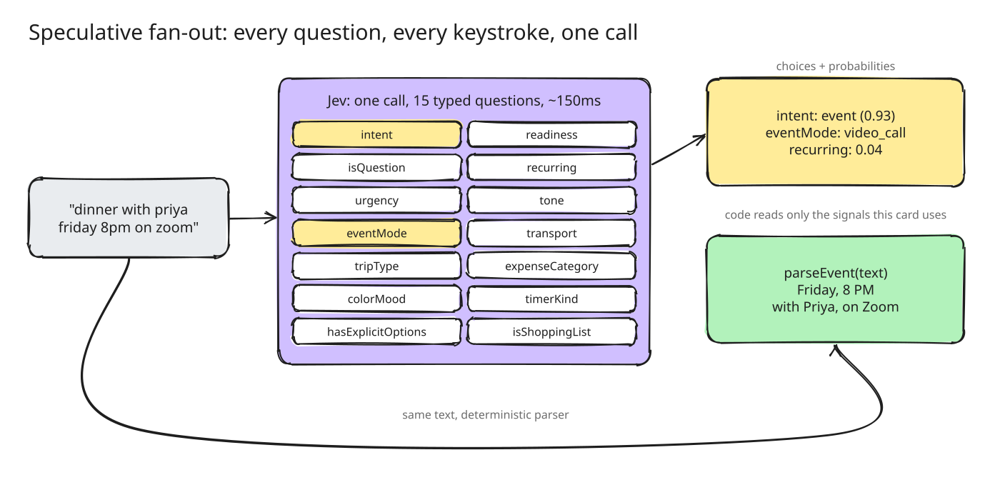
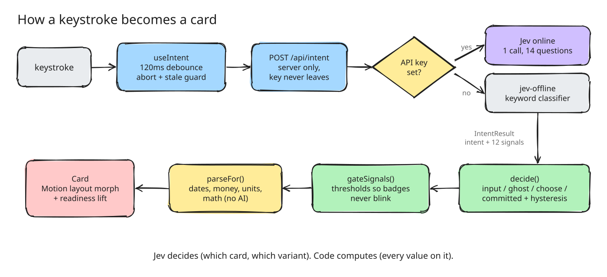
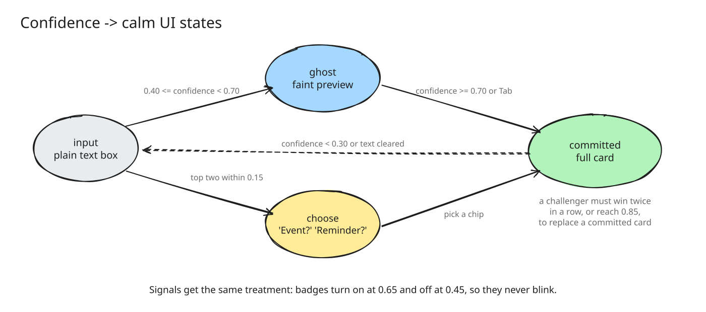

# Plasis

**Type what you need. Get the UI.** One text box that turns what you type into the right card, with no type, mode or menu to pick first: an event, a reminder, a work item, a checklist, a bill split and more. Type two things in one line and you get two cards.

**[Try it live →](https://plasisui.vercel.app)**

<p align="center">
  
</p>

> Plasis is inspired from [Shapeshift](https://github.com/anishfn/shapeshift) by Anish (MIT), committed unchanged as the baseline `f592fe2`. Everything after that commit is my work, listed under [What I built](#what-i-built).

```
dinner with priya friday 8pm on zoom                      →  Event · Friday · 8 PM · Priya · Video call
bug checkout broken on safari @riya p1 by friday          →  Issue · Bug · Riya · High priority · due Friday
lunch with sam friday 1pm and remind me to book a table   →  Event  +  Reminder (offers "before Friday, 1 PM")
split 2400 between 3                                      →  ₹800 each
```

## What I built

| Feature | What it does | Where |
| --- | --- | --- |
| **Issue card** | "bug login broken on safari @riya high" → type, assignee, collaborators, priority and due date, with no type picker. Built through the 5-step card recipe below | `src/lib/parse/issue.ts`, `src/components/intents/IssueCard.tsx` |
| **Attachments** | Drop files on an issue card; stored in IndexedDB (not localStorage, which a single screenshot would fill) | `src/lib/attachments.ts` |
| **"Did you mean?"** | When code spots a value it won't set on its own ("high" → *high priority*), the word is underlined; hover or tap it to accept or deny. Accepting rewrites the text, so saved cards rebuild the same way | `src/lib/suggestions.ts`, `SuggestionTip.tsx` |
| **Two intents in one line** | Code finds one join ("and remind me", "and also", ";" …; plain "and" never splits), each half is classified on its own, and two cards show only when both halves are cards of *different* types. A dateless reminder is *offered* the other card's date as a deadline, never given it silently | `src/lib/clauses.ts`, `src/hooks/usePair.ts` |
| **Measuring the classifiers** | Scripts compare the free offline scorer with the Jev model: 85% card agreement on 101 sentences after tuning, and 24/24 on labelled two-intent lines for both | `scripts/measure.ts`, `scripts/measure-pairs.ts` |
| **Fixes found on the way** | e.g. "billable" leaking into expense items, misspelled "tomorrow" not read as a date, "before" leaking into reminders, curly apostrophes, offers acting while hidden | across `src/lib/parse/`, with tests |

## How it works

Intent is classified by [TypeSafe AI](https://typesafe.ai)'s **Jev** model: one call answers 15 typed questions in parallel (which card, plus signals like "is it a video call?" or "is it urgent?"). Everything else (dates, amounts, units, math) is deterministic code. **Jev decides, code computes.**

<p align="center"></p>

It runs **fully offline by default** with a built-in keyword classifier that returns the same output shape, so no account is needed.

<p align="center"></p>

Raw model output flickers while you type, so a small state machine turns confidence into calm UI states: a card only changes when a challenger wins twice in a row (or is very sure), and signal badges use an on/off hysteresis band.

<p align="center"></p>

The diagrams are Excalidraw files; open any `docs/diagrams/*.excalidraw` at [excalidraw.com](https://excalidraw.com) to edit them.

## Quick start

Requires [Bun](https://bun.sh) 1.2+.

```bash
bun install
bun dev
```

Open http://localhost:3000 and start typing. Press <kbd>/</kbd> to see every card type.

### Use the online Jev model (optional)

```bash
cp .env.example .env.local
# then set TYPESAFE_API_KEY=... (https://console.typesafe.ai/keys) or AI_GATEWAY_API_KEY=...
```

Restart `bun dev`. The readout in the bottom-right corner switches from `jev-offline` to the model name. Keys are only read on the server (`/api/intent`) and never reach the browser. If the API is unreachable, the app quietly falls back to offline mode.

| Variable | Default | What it does |
| --- | --- | --- |
| `TYPESAFE_API_KEY` | _(empty)_ | Enables the online model. |
| `AI_GATEWAY_API_KEY` | _(empty)_ | Reaches Jev through Vercel AI Gateway instead (needs purchased gateway credits). `TYPESAFE_API_KEY` wins if both are set. |
| `JEV_MODEL` | `jev-1.13.0` | Pinned model version (TypeSafe route only). |
| `NEXT_PUBLIC_USE_MOCK` | `false` | `true` forces offline even with a key. |
| `NEXT_PUBLIC_SITE_URL` | `http://localhost:3000` | Used for Open Graph metadata. |

## Card types

| Card | Try |
| --- | --- |
| Event | `lunch with rahul and anna tomorrow` |
| Reminder | `remind me to pay rent tomorrow urgent`, `remind me to book a table before fri 1pm` |
| Issue | `bug login broken on safari @riya high priority by friday` |
| Checklist | `buy milk, eggs, bread and coffee` |
| Timer | `25 min focus` |
| Habit | `gym 3x a week` |
| Color | `#ff6b35`, `tiffany blue`, `minecraft diamond` |
| Split | `split 2400 between 3` |
| Expense | `spent 450 on uber`, `cab to client site 640 billable` |
| Convert | `5 miles in km`, `72f to c` |
| Calculate | `18% of 3450` |
| Trip | `flight to goa next weekend` |
| Poll | `pizza or burgers for friday?` |
| Contact | `rahul 98200 12345 rahul@mail.com` |
| Bookmark | `https://vercel.com/blog check later` |
| Countdown | `days until christmas` |
| Time zone | `3pm pst in ist`, `what time is it in tokyo` |
| Random | `roll 2d6`, `flip a coin`, `pick one: tacos, sushi or pizza` |
| Goal | `read 12 books this year, 4 done` |
| Note | anything else |
| **Two at once** | `lunch with sam friday 1pm and remind me to book a table` |

Saved cards live in your browser (`localStorage`, attachments in IndexedDB) until you delete them. Click one to edit it.

### Keyboard

| Key | Action |
| --- | --- |
| <kbd>Enter</kbd> | Save the card (or both cards) |
| <kbd>Esc</kbd> | Clear (or cancel an edit) |
| <kbd>Tab</kbd> | Keep a faint preview; accept an open "Did you mean?" |
| <kbd>←</kbd> <kbd>→</kbd> | Choose between "X or Y?" chips |
| <kbd>/</kbd> | Open every card type |

URL flags: `?debug=1` shows every probability and the two-card split; `?demo=1&loop=1` plays a scripted demo.

## Adding a card type

1. Add the key to `INTENT_KEYS` in `src/lib/jev/types.ts`.
2. Add a non-overlapping criterion to `intent` in `src/lib/jev/questions.ts`.
3. Write a parser in `src/lib/parse/` and register it in `src/lib/parse/index.ts`.
4. Write a card component in `src/components/intents/` and add a registry entry.
5. Teach the offline classifier in `src/lib/jev/mock.ts`, and add tests.

| Path | What lives there |
| --- | --- |
| `src/components/intents/registry.ts` | **The extension point.** One entry per card type. |
| `src/lib/jev/questions.ts` | The Jev question schema |
| `src/lib/jev/mock.ts` | Offline keyword classifier (same output shape) |
| `src/lib/parse/` | One deterministic parser per card type |
| `src/lib/decide.ts`, `src/lib/signals.ts` | The calm-UI state machine |
| `src/lib/clauses.ts`, `src/hooks/usePair.ts` | Two intents in one line |
| `src/components/plasis/` | Shell, chips, palette, saved list, suggestions, HUD |

## Development

```bash
bun run check    # typecheck + lint + tests
bun run build
bun --conditions=react-server scripts/measure.ts        # offline scorer vs Jev (needs a key, costs a little)
bun --conditions=react-server scripts/measure-pairs.ts  # two-intent lines vs Jev
```

Stack: Next.js (App Router) · React 19 · TypeScript (strict) · Tailwind CSS v4 · shadcn/ui · Motion · chrono-node · zod · TypeSafe AI SDK.

## Where it's going

From fixed cards to components: developers define a design system's primitives, and anyone can type what they need to get a component assembled from those approved pieces, saved as a typed spec that can render a preview or export code.

## License

[MIT](LICENSE)
